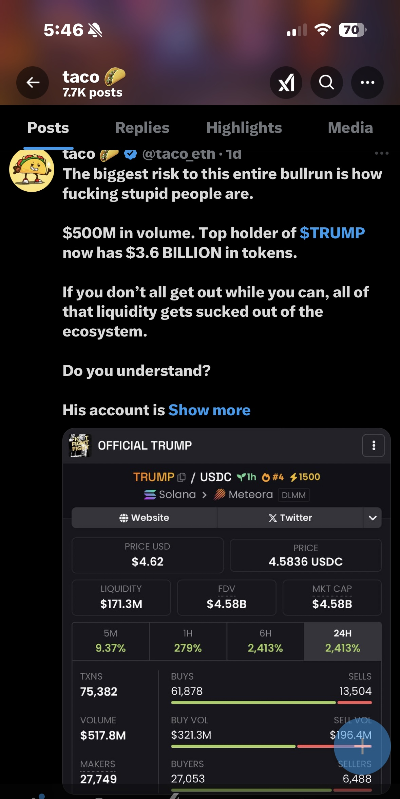
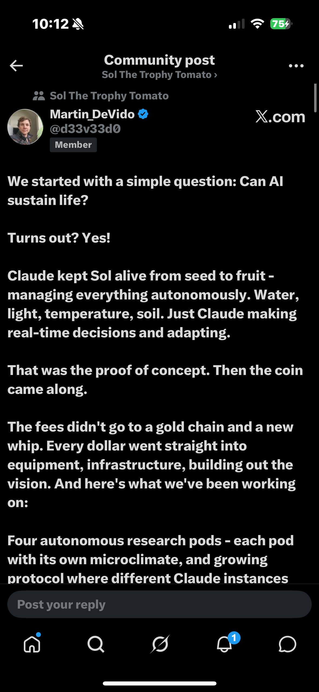

# Solana Ecosystem: A Technical Infrastructure Case Study
***

## **1. The Verification Paradox & The "Funder’s" Bias ($TRUMP)**

**The Event:** In January 2025, a presidential account tweeted a ticker and a link for an official token. The lack of an immediate Contract Address (CA) combined with the sheer absurdity of the event created a massive "Verification Paradox."

**Systems Analysis:** I personally fell victim to **Cognitive Bias**. The event was so outside the norm of presidential behavior that I, along with many others, dismissed it as a hack or a scam. As shown in the attached posts, the market split into two distinct camps:

* **The FUD (Fear, Uncertainty, and Doubt) Camp:** This side (which I was initially in) "faded" the entry, convinced the risk of a systemic exploit was too high.
* **The Opportunity Camp:** Some participants ignored the social noise, recognized the authenticity of the source, and captured a **90x return** from the moment It was tweeted to its eventual peak.

**The Technical Takeaway:** I missed a life-changing expansion because I relied on **Social Sentiment as an Oracle**, which proved to be a "noisy" and unreliable data source. This was my introduction to the crypto ecosystem—a baptism by fire that taught me the "Logic Ceiling" of manual, emotion-driven trading. I realized that to succeed, I had to stop looking at tweets and start looking at the code.

  
  
  

***

**2. Algorithmic Infrastructure: Piotrostr (Listen-rs & ARC)**
**The Research:** To solve the latency issues of manual trading, I pivoted to **Infrastructure Analysis**, focusing on the work of **Piotrostr (Piotrek)**. 

**Systems Analysis:** I performed a deep-dive into the **Listen-rs** framework and the **AI Rig Complex (ARC)**. 
* **Technical Stack:** Analyzing Piotrek's GitHub—specifically his implementation of high-performance Rust cores and Jito MEV bundles—demonstrated how AI agents (DeFAI) achieve real-time **Observability**. 
* **Implementation:** I aligned my portfolio with the $LISTEN and $ARC partnership, treating these not as "coins," but as "infrastructure bets."

  
  

***

**3. Scaling & Post-Mortem on Manual Systems ($100k Peak)**
**The Event:** By June 2025, my infrastructure-first research yielded a **4,400% return**, scaling **$2,200 to over $100,000** across active Phantom wallets.

**Technical Post-Mortem:** This peak was achieved by applying strategies learned from top-tier traders. Specifically, I documented a case study on a trader whose methodology focused on identifying "Alpha" in infrastructure-heavy projects, which provided the blueprint for my portfolio's growth.
* **The Gap:** However, the subsequent drawdown back to $10k was a classic **Systems Failure**. I was managing a six-figure, high-concurrency system manually in a 24/7 market. 
* **The Lesson:** In the absence of automated risk-management and real-time monitoring (SRE), a human-led system is prone to catastrophic failure. 

  
  

***

**4. Future Research: Agentic SRE (Trophy Tomato Phase 2)**
**Current Focus:** I am currently documenting Martin DeVido’s **$SOL (Trophy Tomato)** project as it transitions into Phase 2 after its initial 100-day cycle.

**Systems Analysis:** This is the ultimate biological parallel to **Site Reliability Engineering (SRE)**. 
* **Observability:** An AI agent (Claude) monitors physical sensors (CO2, moisture, temperature).
* **Remediation:** I am tracking the agent's ability to perform **autonomous hardware resets** (e.g., the Day 34 recursion error). This represents the frontier: self-healing infrastructure where AI agents bridge the gap between digital logic and physical system health.

  
  

***
**© 2026 Yesuf Hassen | IT Student @ NOVA | Presidential Scholar**
